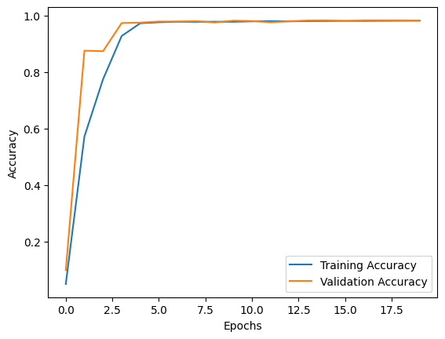

# Brain tumor classification and segmentation, ENGS 106 final project
## UNet Segmentation
Trained for 20 epochs with 32 batch size. Used the dice coeffecient and dice loss to determine how much do the ground-truth and the predicted masks overlab. Training for more epochs is eventually going to lead to more accurate segmentation of the tumors.
<table>
  <tr>
    <td align="center">
       
      <em>Accuracy over Epochs</em>
    </td>
    <td align="center">
       
      <em>Dice Coeffecient Loss over Epochs</em>
    </td>
  </tr>
</table>

  
  
<em>True vs Mask 1</em>

  
  
  
<em>True vs Mask 2</em>

 
  
<em>True vs Mask 3</em>

  
  
<em>True vs Mask 4</em>

### Link to the trained UNet Model:

  <h2><a href="https://drive.google.com/drive/folders/1tLgqE4yXmmK_8laLebRbEMb98bWcG6A-?usp=sharing">UNet model</a></h2>

### ResNet152V2 Tumor Classification

Residual networks use “skip” or residual connections on top of the original input.​ ResNet-152 is built from four stages of “bottleneck” blocks, each containing three convolutional layers plus a skip connection. This architecture helps capture complex representations such as detailed spatial features from MRI scans.​

Here, we utilize ResNet152 to solve the task of given an fMRI brain scan, assign it one of the following classes **["Meningioma tumor", "Glioma tumor", "Pituitary tumor", "No Tumor]**. Trained for 20 epochs at a batch size of 16 at 512 resolution.
